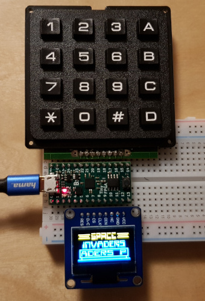

# CHIP-8 console on FPGA

This a [CHIP-8](https://en.wikipedia.org/wiki/CHIP-8) game console emulator
working on FPGA chip ([TinyFPGA BX](https://www.crowdsupply.com/tinyfpga/tinyfpga-bx)).

### Implementation notes

(TODO)

## Hardware

I'm using the following:

* [TinyFPGA BX](https://www.crowdsupply.com/tinyfpga/tinyfpga-bx) with Lattice iCE40-LP8K chip
* [SparkFun 16-button keyboard](https://www.sparkfun.com/products/14881)
* [WaveShare 128x64px monochrome OLED screen](https://www.waveshare.com/0.96inch-oled-b.htm)

## Source code outline

Verilog modules:

* `chip8.v` - top-level module for TinyFPGA BX
* `cpu.v` - CPU with memory controller
* `mem.v` - system memory
* `gpu.v` - sprite drawing
* `bcd.v` - BCD conversion circuit (byte to 3 decimal digits)
* `screen_bridge.v` - bridge between OLED and CPU (to access frame buffer in
  system memory)

Tests:

* `*_tb.v` - test-benches for modules (see below on how to run)
* `asm/` - various assembly programs

Games:

* `games/` - game ROMs, taken from http://devernay.free.fr/hacks/chip8/

The [fpga-tools](https://github.com/pwmarcz/fpga-tools/) repo is included as a
submodule:
* `fpga.mk` - Makefile targets
* `components/oled.v` - OLED screen
* `components/keypad.v` - keypad

## Running the project

See [INSTALL.md](INSTALL.md).

## License

By Paweł Marczewski <pwmarcz@gmail.com>.

Licensed under MIT (see [`LICENSE`](LICENSE)), except the `games` directory.

## See also

* [fpga-tutorial](https://github.com/pwmarcz/fpga-tutorial) - my FPGA workshop
* [fpga-experiments](https://github.com/pwmarcz/fpga-experiments) - a repo where I prototyped some of these things
* [CHIP-8 technical specification](http://devernay.free.fr/hacks/chip8/C8TECH10.HTM)
